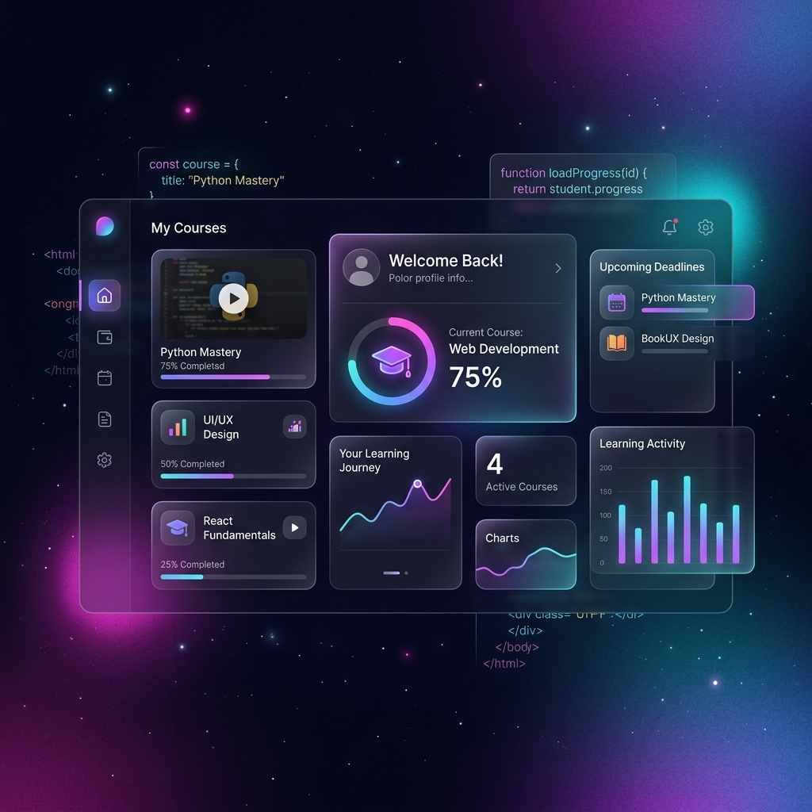

# MyCourse - Modern Learning Management System



MyCourse is a premium, full-stack learning platform designed to provide a seamless educational experience. Built with **Django** and **Next.js**, it features a beautiful glassmorphic UI, robust video progress tracking, and an intuitive dashboard for learners.

## ✨ Features

- **🎓 Personalized Dashboard**: Track your "Journey," see upcoming deadlines, and resume your most recent courses with a single click.
- **📺 Smart Video Player**: Integrated YouTube player that remembers your exact position. Never lose your place in a lecture again.
- **📊 Progress Tracking**: Real-time progress bars and "heartbeat" API that syncs your learning activity across devices.
- **📂 Course Syllabus**: Structured learning paths with modular videos and easy navigation.
- **🔐 Secure Authentication**: JWT-based authentication for a secure and smooth login experience.
- **📱 Responsive Design**: Fully optimized for desktops, tablets, and mobile devices with a dark-mode-first aesthetic.

## 🛠️ Technology Stack

### Backend
- **Framework**: Django 4.2+
- **API**: Django REST Framework (DRF)
- **Auth**: SimpleJWT
- **Database**: PostgreSQL (Production), SQLite (Development)
- **Static Files**: WhiteNoise
- **Deployment**: Render-ready with Gunicorn

### Frontend
- **Framework**: Next.js 15 (React 19)
- **Styling**: Vanilla CSS (Custom tokens and glassmorphism)
- **Icons**: Lucide React
- **API Client**: Axios with interceptors
- **Video**: YouTube IFrame API

---

## 🚀 Getting Started

### Prerequisites
- Python 3.9+
- Node.js 18+
- npm or yarn

### 1. Backend Setup
```bash
cd backend
python -m venv venv
source venv/bin/activate  # On Windows: venv\Scripts\activate
pip install -r requirements.txt
python manage.py migrate
python manage.py runserver
```
*Note: Ensure you create a `.env` file in the `backend/` directory based on `.env.example`.*

### 2. Frontend Setup
```bash
cd frontend
npm install
npm run dev
```
*Note: The frontend will be available at `http://localhost:3000`.*

---

## 🌐 Deployment

The project is pre-configured for seamless deployment.

### 1. Frontend (Vercel)
The frontend is optimized for [Vercel](https://vercel.com). The directory contains a root `vercel.json` and `package.json` to handle the monorepo structure automatically.

**Steps:**
1. Connect your GitHub repository to Vercel.
2. Vercel will automatically detect the configuration.
3. **Environment Variables**: Add the following in the Vercel dashboard:
   - `NEXT_PUBLIC_GOOGLE_CLIENT_ID`: Your Google OAuth Client ID.
   - `NEXT_PUBLIC_API_URL`: Your deployed Backend URL (e.g., `https://mycourse-backend.onrender.com/api`).

### 2. Backend (Vercel)
The backend is optimized for [Vercel](https://vercel.com) using `@vercel/python`. This allows for completely free hosting without a credit card.

**Steps:**
1. Create a **New Project** on Vercel.
2. Select the same repository.
3. **Root Directory**: Set this to `backend`.
4. Vercel will automatically use `vercel.json` and `vercel_app.py`.
5. **Environment Variables**:
   - `SECRET_KEY`: A secure random string.
   - `DEBUG`: `False`.
   - `DATABASE_URL`: Your **Neon.tech** PostgreSQL URL.
   - `ALLOWED_HOSTS`: `.vercel.app`.
   - `CORS_ALLOWED_ORIGINS`: Your Vercel frontend URL.

### 3. Database (Neon.tech)
Highly recommended for a free, "no-card" managed PostgreSQL database.
1. Create a free account on [Neon.tech](https://neon.tech).
2. Create a new project and copy the **Connection String**.
3. Use this string as your `DATABASE_URL` in Vercel.

---

## 📄 License

This project is licensed under the MIT License - see the [LICENSE](LICENSE) file for details.

---

Built with ❤️ by [Suraj Kekan](https://github.com/surajkekan)
